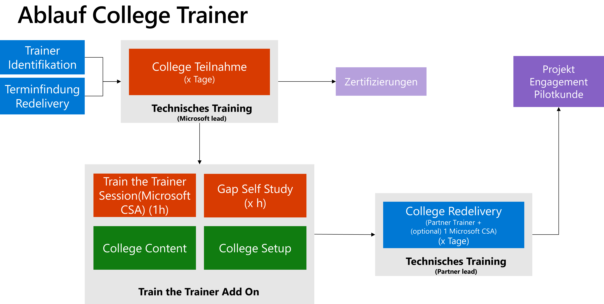
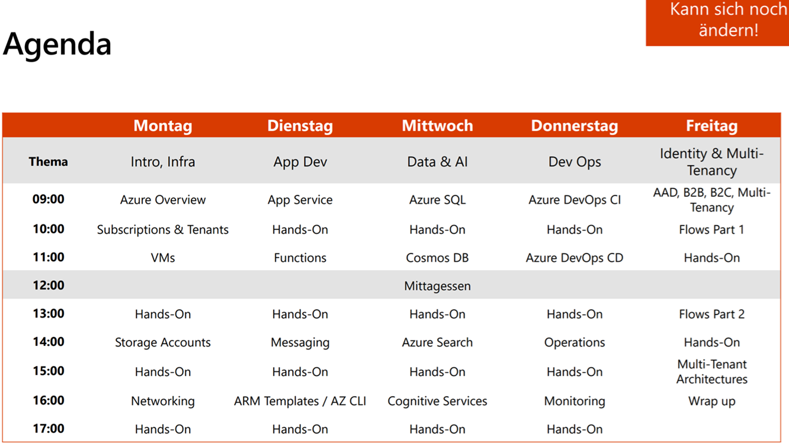
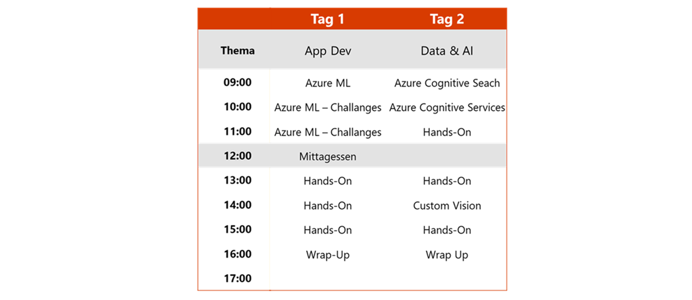
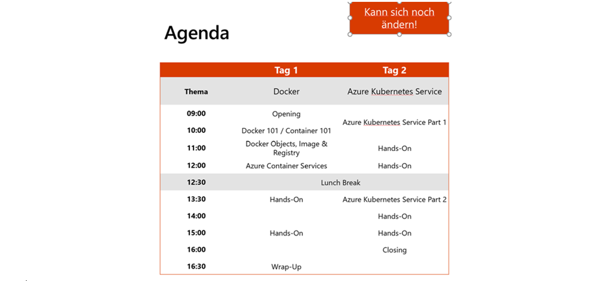
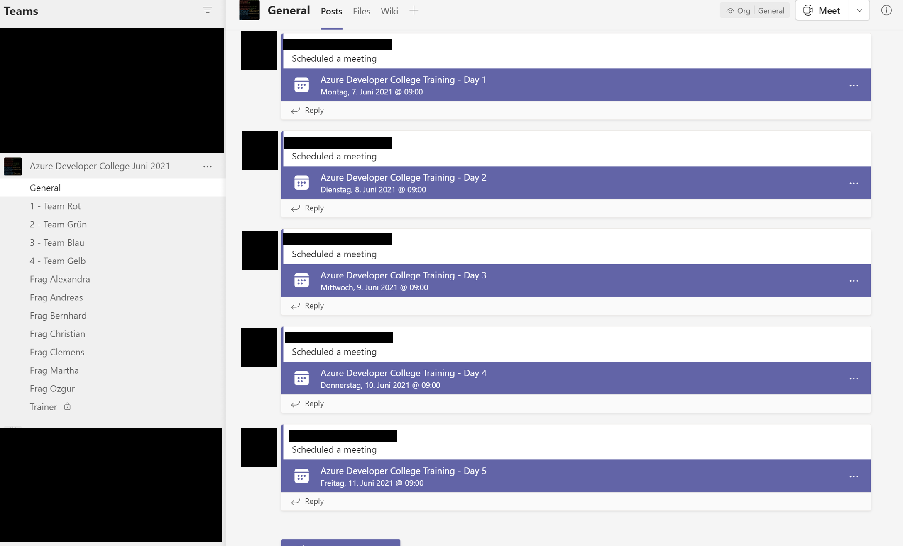

# Overview

## College Calender and Content

[**Upcoming events, details and registration**](https://www.microsoft.com/de-de/partner/readiness/default.aspx?Suchbegriff=MSDE#main-content)

Our workshops are publicly accessible content which can also be used for further education without registration.

- [Azure Developer College](https://azuredevcollege.com/trainingdays/)
- [AI College for Developer](https://github.com/aidevcollege/aidevcollege)
- [Container College](https://azuredevcollege.com/trainingdays/day6/)

## Target group

In particular, we are looking for partners who have a project in prospect, which we can accompany within the framework of the College and support through our Solution Architects (Build Track). Partners with projects will therefore be given priority in the College.

## Dedicated Delivery

You have many interested colleagues and would love a delivery of a college only for your organization? Let us know, so we can discuss the prerequisites and organize the college. **If you are interested, please contact: t-kelghawi@microsoft.com or raikher@microsoft.com**

# Train the Trainer

You want to hold the colleges internally in your company? Let our Cloud Solutions Architects train you as a trainer and organize your own colleges!
**If you are interested, please contact: t-kelghawi@microsoft.com or raikher@microsoft.com**

## Azure Developer College

The Azure Developer College is the kick-start for the Cloud Native Application Developer training. Participants receive the tools for successful software development in the cloud through a combination of theory and practical elements within a one-week training block.

During the training week, what has been learned is applied directly in the hands-on sessions. Upon completion of the college, each participant receives a certification voucher, depending on availability, in order to have the acquired know-how validated in the context of an official exam. There is also the option of participating in the Build Track beyond the training week with Microsoft Solution Architects to apply what has been learned to a concrete customer project.

**Prerequisites**

[Tutorial: Set up system for Azure Developer College](https://azuredevcollege.com/trainingdays/day2/challenges/00-challenge-setup.html)

## AI College for Developer

The AI College for Developers is a deep dive into Azure AI tools for developers. Participants receive the tools for the successful development of AI solutions in the cloud through combined theory and practical elements within a 2-day training block.

During the college, what is learned is directly applied in hands-on sessions. Upon completion of the college, each participant receives certification vouchers, depending on availability, in order to have the acquired know-how validated in the context of an official exam.

**Prerequisites**

[Tutorial: Install Visual Studio Code](https://azuredevcollege.com/trainingdays/day2/challenges/00-challenge-setup.html#visual-studio-code)

[Tutorial: Install Node.js](https://azuredevcollege.com/trainingdays/day2/challenges/00-challenge-setup.html#node-js)

## Container College

We are exclusively offering you a 2-day training (as an add-on for all Azure Developer College alumni). These two days will focus on container technologies on Azure.

**Prerequisites**

[Tutorial: Setting up the system for the Container College](https://github.com/azuredevcollege/trainingdays/blob/master/day6/challenges/challenge0.md)

## FAQ

### Video Tutorial: How do I join the team?

<iframe width="560" height="315" src="https://www.youtube.com/embed/CNxuV0pzf7A" title="YouTube video player" frameborder="0" allow="accelerometer; autoplay; clipboard-write; encrypted-media; gyroscope; picture-in-picture" allowfullscreen></iframe>

If there are difficulties with the access, open the **link from the invitation** in the in-private mode of the browser or use another browser. If you have not yet received an invitation, please let us know. In some cases an alternative email address (e.g. ...@outlook.com) is necessary for the invitation to the team.

**Important: You need to have access to the teams in order to conduct the hands-on sessions and to be able to ask the coaches questions! The teams should then look like this for everyone:**

### Is my subscription sufficient?

>[!WARNING]
>An Azure Subscription is required to participate in Azure Container Days for Developers.
A Trial Subscription is not sufficient for participation. In order to participate successfully, you will find three options below to ensure subscription access to the required resources:

- **Option 1:** Access to a subscription by the company.
The total cost per participant is about 50,00€.

- **Option 2:** Upgrading the trial to a paid subscription.
The costs incurred will be deducted from the credit card on file.
Suggestion: Charge the costs incurred to the company as expenses, of course after prior consultation with the respective responsible persons in your company. Also here the costs amount to approx. 50,00€ per participant.

- **Option 3:** We provide you with an Azure Subscription worth $100.00 (US dollars).
This costs 100.00€ plus VAT and cannot be taken back as soon as it is awarded.

**Permissions in the subscription**
Please make sure that the following roles are assigned to you:

Azure Active Directory:

- Application Administrator Role

Subscription:

- Owner Role
- Permission to deploy any resource in your subscription

A Paid Subscription (Option 2) as well as the Subscription we provide (Option 3) ensure this. Here you are a Global Administrator.

### I have a Visual Studio Enterprise MSDN subscription, is it enough?

Yes, with the MSDN Subscription you can tackle the Challenges without any problems.

### I don't have a calendar entry yet, why?

Calendar invitations will be sent to all approved participants **at least 1 week prior to the start** of the college for the workshop day(s). These will contain the dial-in information for the teams meeting.

### I didn't complete all the challenges, now what?

The GitHub repos remain and are always accessible. The teams channels formed as part of the college will be available for 1 month after the completion of the college until they are deleted for compliance reasons. Until then, the channel can still be used.

### How much Azure Consumption can I expect?

For a 5-day college, you can expect a consumption of about 50€.

### Is there a certificate for attending the college?

There is no certificate for completing the college. However, depending on availability, each participant will receive certification vouchers after completing the college in order to have the acquired know-how confirmed in an official exam.

